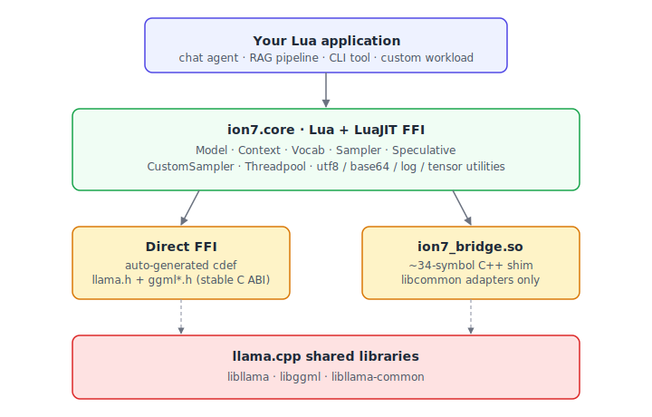
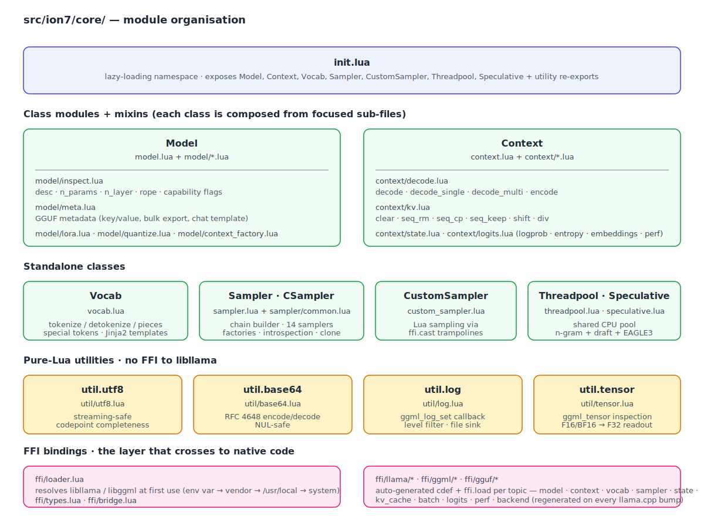
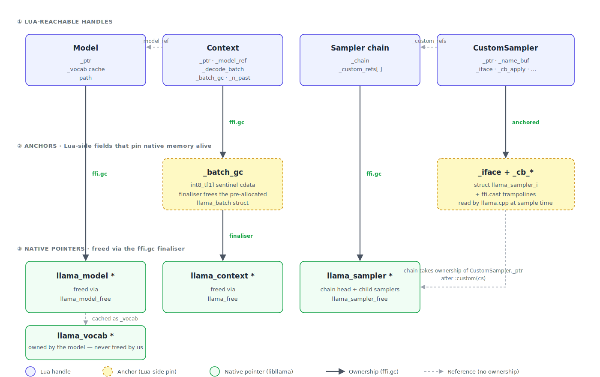
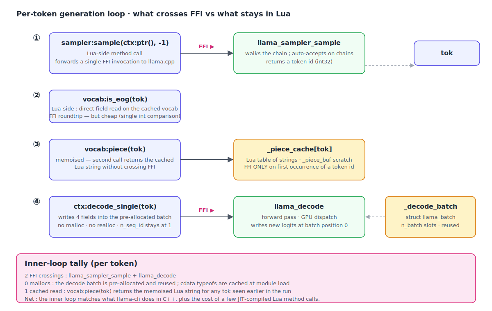
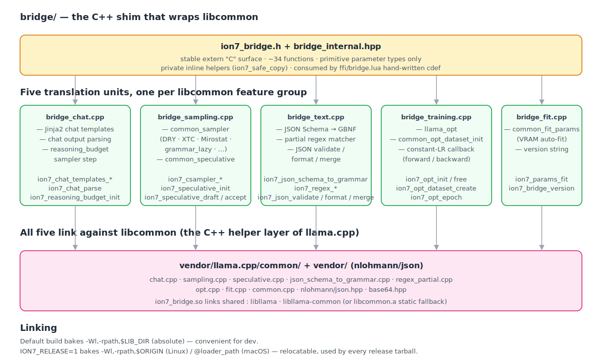
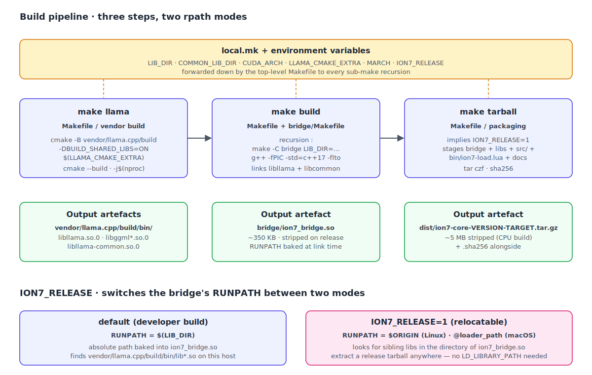

# ion7-core architecture

A walkthrough of the technical decisions behind ion7-core, aimed at
contributors and curious users. The user-facing API surface is in
[`README.md`](README.md) ; this document covers the **why** and the
**how** of the runtime, the bridge, and the build system.

---

## 1. Layered overview

<p align="center">
  
</p>

Four tiers, top to bottom :

1. **Your Lua application.** Anything from a 30-line CLI prompt to a
   full agent loop.
2. **`ion7.core` — the runtime.** Pure Lua + LuaJIT FFI. Owns the
   public API : `Model`, `Context`, `Vocab`, `Sampler`,
   `CustomSampler`, `Threadpool`, `Speculative`, plus four utility
   modules (`utf8`, `base64`, `log`, `tensor`).
3. **Two cohabiting consumption paths into native code :**
   - **Direct FFI** for everything `llama.h` and `ggml*.h` already
     expose as a stable C ABI — auto-generated `cdef` blocks under
     `src/ion7/core/ffi/llama/` and `src/ion7/core/ffi/ggml/`.
   - **`ion7_bridge.so`** — a ~34-symbol C++ shim (5 translation units
     under `bridge/`) that adapts the libcommon C++ helpers (chat
     templates, advanced samplers, JSON-Schema → GBNF, speculative,
     training) to a flat C ABI consumable by LuaJIT FFI.
4. **`llama.cpp` shared libraries.** `libllama`, `libggml`,
   `libllama-common` — pinned per release as a vendored submodule.

The split is deliberate. Wrapping every llama.cpp function through a
fat C bridge would couple the Lua surface to every upstream API churn ;
binding everything via raw FFI would force us to re-implement chat
templates, JSON-schema-to-GBNF and speculative decoding from scratch
in Lua. Splitting the responsibility lets each side do what it does
best.

---

## 2. The two-path principle

The **direct FFI** path covers the inference happy path :

| Module | Wraps |
|--------|-------|
| `ffi/llama/model.lua`     | `llama_model_load_from_file`, `llama_model_n_*`, metadata, save, free |
| `ffi/llama/context.lua`   | `llama_init_from_model`, `llama_decode`, `llama_encode`, threading |
| `ffi/llama/vocab.lua`     | `llama_tokenize`, `llama_detokenize`, special-token accessors |
| `ffi/llama/sampler.lua`   | every `llama_sampler_init_*` and chain ops |
| `ffi/llama/state.lua`     | snapshot / restore / save / load (file + memory) |
| `ffi/llama/kv_cache.lua`  | the `llama_memory_*` family (post-`llama_kv_self_*` upstream) |
| `ffi/llama/batch.lua`     | `llama_batch_init`, `llama_batch_free`, `llama_batch_get_one` |
| `ffi/llama/logits.lua`    | logits + embedding readers |
| `ffi/llama/perf.lua`      | `llama_perf_*` counters |
| `ffi/llama/backend.lua`   | `llama_backend_init`, `llama_supports_*`, `llama_log_set` |
| `ffi/ggml/*`              | tensor introspection, threadpool primitives |

Each file is auto-generated from the upstream headers by a small Lua
script under `scripts/ffi_gen/` ; bumping `vendor/llama.cpp` is then a
matter of regenerating, eyeballing the diff, and committing.

The **bridge** path covers the C++ helpers libcommon provides :

| Bridge function (selection) | Backed by |
|-----------------------------|-----------|
| `ion7_chat_templates_*`     | `common_chat_templates` (Jinja2) |
| `ion7_chat_parse`           | `common_chat_parse` |
| `ion7_csampler_*`           | `common_sampler` (DRY / XTC / Mirostat / grammar_lazy) |
| `ion7_speculative_*`        | `common_speculative` (n-gram cache, draft model, EAGLE3) |
| `ion7_json_schema_to_grammar` | `json_schema_to_grammar.cpp` |
| `ion7_regex_*`              | `regex_partial.cpp` |
| `ion7_json_*`               | `nlohmann/json` re-exposed in flat C |
| `ion7_opt_*`                | `llama_opt` + `common_opt_dataset_init` (training) |
| `ion7_params_fit`           | `common_fit_params` (VRAM auto-fit) |
| `ion7_reasoning_budget_init`| custom sampler that caps `<think>...</think>` blocks |

The bridge re-exports each of these as `extern "C"` with primitive
parameter types only — no `std::vector`, no `std::string`, no
exceptions cross the ABI line. The Lua side picks them up via a
hand-written `cdef` in `src/ion7/core/ffi/bridge.lua`.

**Why hand-written and not auto-generated for the bridge ?** Because
`ion7_bridge.h` is a stable, human-curated API that intentionally
freezes around 34 functions. Re-running a generator on it on every
upstream bump would be pointless churn ; running the generator on
`chat.h` / `sampling.h` / `speculative.h` directly would force us to
fight C++ name mangling and template specialisations — exactly what
the bridge was created to avoid.

---

## 3. Module organisation

<p align="center">
  
</p>

Two patterns are worth highlighting :

**Mixins.** `Model` and `Context` each import their methods from
several sub-modules and splice them into a single metatable. The
public require path stays `ion7.core.model` / `ion7.core.context` ;
the split exists to keep individual files small and focused. Adding a
new method group is a matter of dropping a new file under `model/` or
`context/` and adding one `for k, v in pairs(require ...)` loop.

**Lazy class loading.** `init.lua` exposes `ion7.Model`, `ion7.Vocab`,
`ion7.Sampler`, etc. via a `__index` metatable hook. The first access
triggers the `require` ; subsequent accesses are direct table reads.
A consumer that only wants `ion7.Vocab` never pays the load cost of
`ion7.Sampler` — meaningful for short-lived scripts that exit before
ever sampling a token.

---

## 4. Lifetime and ownership

<p align="center">
  
</p>

Every Lua-side handle either owns its native pointer through
`ffi.gc(ptr, free_fn)` or is anchored on a parent Lua handle that
does. The arrows above show the ownership chain ; dashed arrows are
references that keep something alive without owning it.

Concrete rules :

- **`Model`** owns `llama_model *`. Freed via `llama_model_free` on
  GC or explicit `Model:free`. The `Vocab` it caches under
  `_vocab` shares its lifetime — `llama_vocab *` is owned by the
  model, we never free it ourselves.

- **`Context`** owns `llama_context *` and a pre-allocated
  `llama_batch`. Two separate `ffi.gc` slots :
  - `_ptr` → `llama_free` for the context itself.
  - `_batch_gc` → a 1-byte sentinel cdata whose finaliser frees
    `_decode_batch`. Lua's GC does not visit nested cdata fields,
    so an explicit sentinel is the only way to make the batch
    finalise on its own.
  Plus a `_model_ref` plain Lua reference back to the parent
  `Model` — keeps the model alive as long as any context still
  depends on it, regardless of GC ordering.

- **`Sampler`** owns the chain head `llama_sampler *` ; sub-samplers
  are owned by the chain (we don't `ffi.gc` them). On `Sampler:free`
  the chain's free callback iterates and frees children.

- **`CustomSampler`** is the trickiest. The chain takes ownership of
  the underlying `llama_sampler *` after `:custom(cs)` is called, so
  the wrapper does NOT `ffi.gc` it. The wrapper instead anchors
  every `ffi.cast` trampoline (`_cb_name`, `_cb_apply`, `_cb_accept`,
  `_cb_reset`, `_cb_free`) and the `_iface` struct on its own fields
  so they outlive the chain that holds pointers into them. The
  builder pins the wrapper in `_custom_refs` for the chain's
  lifetime ; once both go out of scope, everything is collected
  together.

- **`Threadpool`** owns its `ggml_threadpool *`. The pool is
  created (and freed) through the CPU backend's proc-address path,
  not via direct calls to `ggml_threadpool_new` — see §6.

A non-obvious consequence of the chain-takes-ownership rule for
`CustomSampler` : a single `CustomSampler` instance must NOT be
plugged into more than one chain. The first chain's free will release
the underlying `llama_sampler *`, leaving the second chain holding a
dangling pointer. Build a fresh wrapper per chain.

---

## 5. The hot path

Token generation runs in a tight loop :

```lua
for _ = 1, MAX_GEN do
    local tok = sampler:sample(ctx:ptr(), -1)      -- C call
    if vocab:is_eog(tok) then break end
    io.write(vocab:piece(tok))                     -- piece is memoised
    ctx:decode_single(tok)                         -- writes into pre-allocated batch
end
```

<p align="center">
  
</p>

Three optimisations live behind that simplicity :

**Pre-allocated decode batch.** The `Context` constructor allocates a
`llama_batch` sized to `n_batch` and initialises every
`n_seq_id[i] = 1` once. The hot path only touches `token[i]`,
`pos[i]`, `seq_id[i][0]` and `logits[i]` on each call ; no malloc per
token, no struct rebuild.

**Cached `ffi.typeof`.** Every cdata constructor used on the hot path
(`llama_token[?]`, `int32_t[?]`, `float[?]`, `char[?]`) is resolved
through a module-local `ffi.typeof` once at module load. Re-calling
`ffi.typeof("int32_t[?]")` per iteration would force LuaJIT to
re-parse the cdecl on every trace abort.

**`piece()` memoisation.** `Vocab:piece(token)` caches the resulting
Lua string under `_piece_cache[token]`. Streaming output emits the
same hundred-or-so common tokens repeatedly ; the second call for
"the" or "a" returns a cached pointer without crossing FFI.

The combined effect : in a typical generation loop, the only FFI
boundary crossings are `llama_sampler_sample` and `llama_decode` —
exactly what `llama-cli` does in C++.

---

## 6. Bridge anatomy

<p align="center">
  
</p>

Two non-obvious bits worth documenting :

**The `cparams_dft` seed.** When a caller drives speculative decoding
with a separate draft model, libcommon's `common_speculative_init`
spins up an internal context for the draft via
`llama_init_from_model(model_dft, params.cparams_dft)`. Default-
constructed `cparams_dft` is zero-initialised — `n_ctx = 0` — and
the resulting context creation crashes the process. The bridge
seeds `cparams_dft` from `llama_context_default_params()` and
mirrors the target's window size before forwarding the call.

**The `mparams_dft.path` sentinel.** libcommon's `has_draft` gate
checks `!params.mparams_dft.path.empty()` to decide whether to
register the DRAFT implementation in the speculative engine — even
when `model_dft` is provided directly. The bridge sets the path to
`"<external>"` whenever a draft context is supplied, just to satisfy
the gate.

Both fixes live in `bridge_sampling.cpp` ; they are inline-commented
with the libcommon line they paper over.

---

## 7. Build pipeline

<p align="center">
  
</p>

The top-level `Makefile` orchestrates two builds and a packaging
step.

**Vendor build (`make llama`).** Configures and builds
`vendor/llama.cpp/build/` via CMake, with sensible defaults
(`-DCMAKE_BUILD_TYPE=Release -DBUILD_SHARED_LIBS=ON -DLLAMA_BUILD_TESTS=OFF`).
Pass `LLAMA_CMAKE_EXTRA="-DGGML_CUDA=ON"` (or `-DGGML_VULKAN=ON`,
`-DGGML_METAL=ON`, `-DGGML_HIPBLAS=ON`) to opt into a backend.

**Bridge build (`make build`).** Recurses into `bridge/Makefile` with
`LIB_DIR` pointing at the vendor's `build/bin/`. The recipe compiles
each `.cpp` into a `.o` separately (faster incremental builds) then
links a single `ion7_bridge.so`.

**RPATH handling.** Three flavours :

- Default (developer build) — bakes `LIB_DIR` as an absolute rpath.
  Convenient locally : you can rebuild llama.cpp in place and the
  bridge picks up the new libs without setting `LD_LIBRARY_PATH`.
- `ION7_RELEASE=1` — switches the rpath to `$ORIGIN` (Linux) or
  `@loader_path` (macOS). The resulting `.so` looks for sibling
  libraries in its own directory at load time. This is what release
  tarballs ship.
- macOS-only `-Wl,-undefined,dynamic_lookup` defers resolution of
  ggml symbols to load time ; they arrive transitively via
  `libllama.dylib` once the bridge is loaded.

**Packaging (`make tarball`).** Rebuilds with `ION7_RELEASE=1`,
stages the bridge + every llama.cpp shared lib + the Lua runtime +
`bin/ion7-load.lua` into `dist/ion7-core-<version>-<target>/`, and
produces `<dir>.tar.gz` plus a SHA256 file. Used both for local
debugging and as the per-platform job in
`.github/workflows/release.yml`.

**Vendor pinning.** `vendor/llama.cpp` is a Git submodule. Releases
rebuild from whatever commit `vendor/llama.cpp` points at — the
release notes embed the SHA so users can reproduce any binary build.

---

## 8. Versioning and stability contract

`ion7-core` follows semver at the level of the Lua API (`ion7.core`
and its subordinate modules). Breaking changes to `Model.load`,
`Sampler.chain`, etc. require a major bump.

The bridge has its own contract :

- `ion7_bridge.h` is the **stable** surface. Every function declared
  there is preserved across `ion7-core` minor releases. Adding a
  function is a minor bump ; removing one is a major.
- `ffi/llama/*` and `ffi/ggml/*` track upstream `llama.h` and
  `ggml*.h` directly. Their stability is whatever upstream chooses
  to do. When upstream renames a function (it happens), we
  regenerate, and the renaming surfaces as a `wrong number of
  arguments` or `undefined symbol` until callers adapt — same risk
  as using llama.cpp from C++ directly.

The `ffi/bridge.lua` cdef and `bridge/ion7_bridge.h` MUST stay in
sync ; mismatched signatures abort `require` with a clear FFI
parse error. CI runs `tests/00_modules.lua` which loads every
module under stubbed FFI and catches this class of regression
before any model touches the build.
