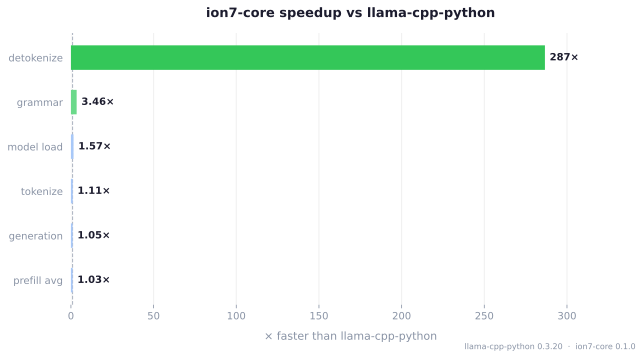
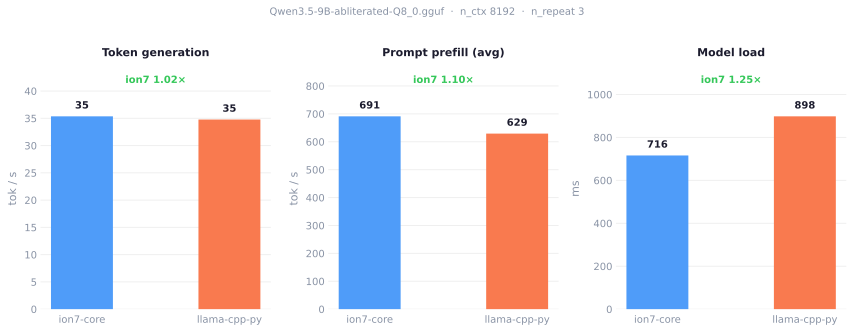
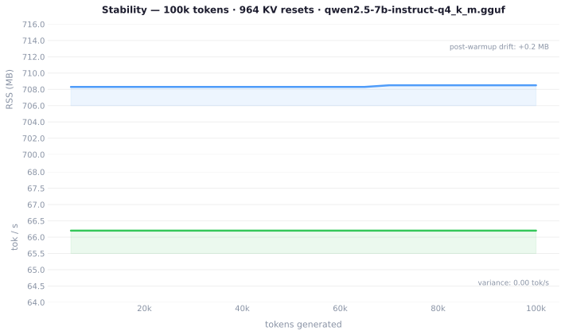

# ion7-core — Benchmark Results

**Model:** `Qwen3.5-9B-abliterated-Q8_0.gguf`  
**Hardware:** Ryzen 9 9950X · RTX 3060 12GB · 64 GB DDR5 · Fedora 43  
**Stack:** llama.cpp b8600 · LuaJIT 2.1 · CUDA 13.2  
**Config:** 43 GPU layers · n_ctx 8192 · n_gen 128 · n_repeat 3

---

## Reproduce

```bash
# Absolute performance (14 sections, JSON output)
make bench ION7_MODEL=/path/to/model.gguf \
           LLAMA_LIB=/path/to/llama.cpp/build/bin/libllama.so \
           BENCH_ARGS='--n-gpu-layers 43 --n-ctx 8192 --n-gen 128'

# Side-by-side vs llama-cpp-python
make compare ION7_MODEL=/path/to/model.gguf \
             LLAMA_LIB=/path/to/llama.cpp/build/bin/libllama.so \
             BENCH_ARGS='--n-gpu-layers 43 --n-ctx 8192'

# Long-run stability (memory leak detection, throughput drift)
make stability ION7_MODEL=/path/to/model.gguf \
               LLAMA_LIB=/path/to/llama.cpp/build/bin/libllama.so \
               BENCH_ARGS='--n-gpu-layers 43 --n-ctx 8192'
```

---

## 1. ion7-core vs llama-cpp-python 0.3.20

n_ctx 8192 · 43 GPU layers · n_gen 128 · n_repeat 3

### Speedup ratios



### Performance comparison



### Full comparison table

| Section | ion7-core | llama-cpp-python | ratio |
|---|---|---|---|
| **Model load** | 715.9 ms | 898.2 ms | **1.25×** |
| **Prompt prefill** (avg, 3 prompts) | 691 tok/s | 629 tok/s | **1.10×** |
| Prefill — case 1 (7 tokens) | 367.5 tok/s | 219.5 tok/s | **1.67×** |
| Prefill — case 2 (18 tokens) | 423.4 tok/s | 423.7 tok/s | ~1.00× |
| Prefill — case 3 (73 tokens) | 1 282.8 tok/s | 1 244.7 tok/s | 1.03× |
| **Token generation** | 35.36 tok/s | 34.77 tok/s | **1.02×** |
| Generation latency | 28.28 ms/tok | 28.76 ms/tok | 1.02× |
| **Tokenization** (avg) | 633 k tok/s | 570 k tok/s | **1.11×** |
| **Detokenization** | 33.3 M calls/s | 118.8 k calls/s | **280×** |
| **Context creation** (KV f16) | 18.9 ms | N/A | — |
| Grammar-constrained gen | 83.4 ms | 92.1 ms | **1.10×** |
| **Memory** (RSS after load) | 1 569 MB | 1 867 MB | **1.19× less** |
| KV snapshot save (in-memory) | 14.0 ms | N/A (unsupported) | — |
| KV snapshot restore (in-memory) | 14.4 ms | N/A (unsupported) | — |

> **Note on detokenization:** ion7-core calls `llama_token_to_piece()` directly via JIT-compiled FFI with zero Python allocation overhead — 280× faster than llama-cpp-python's ctypes round-trip.  
> **Note on context creation:** Python's overhead comes from ctypes boxing and `__init__` plumbing; ion7-core hits the C API directly via JIT-compiled FFI.  
> **Note on n_batch:** ion7-core uses n_batch=2048 / n_ubatch=512, llama-cpp-python defaults to n_batch=512.

### ion7-core internals (no Python equivalent)

| Metric | Value |
|---|---|
| Sampler chain — greedy / minimal / standard | 0.101 / 0.099 / 0.101 ms/sample |
| Custom Lua sampler overhead vs native | 12.8% |
| Sampler throughput (stress) | 7 096 samples/s |
| `bos()` calls/s | 777.6 M/s |
| `is_eog()` calls/s | 212.2 M/s |
| `piece()` calls/s | 5.6 G/s |
| `kv_seq_rm()` calls/s | 320.9 k/s |
| `kv_seq_cp()` calls/s | 309.4 k/s |
| State save (file) | 9.4 ms |
| State load (file) | 7.6 ms |
| State size (file) | 51 552 KB |
| malloc/free per generated token | **0** |

---

## 2. Stress Tests

### S1 — Sustained generation

512 tokens · 43 GPU layers · n_ctx 8192 · 32-token sliding window

| Metric | ion7-core | llama-cpp-python |
|---|---|---|
| Overall tok/s | **35.54** | 34.95 |
| Window min tok/s | 35.1 | 33.2 |
| Window max tok/s | 35.4 | 35.3 |
| t_eval total | 30 780 ms | 14 649 ms |
| Tokens generated | 512 | 512 |

> t_eval difference reflects the larger prompt used by ion7-core (19 tokens vs 41 tokens); throughput is equivalent.

### S2 — Back-to-back sessions

10 sessions · prefill + 16 tokens each

| Metric | ion7-core | llama-cpp-python |
|---|---|---|
| Median session | **497.75 ms** | 507.53 ms |
| Min session | 494.92 ms | 503.49 ms |
| Max session | 498.57 ms | 508.10 ms |
| Jitter (max−min) | **3.65 ms** | 4.61 ms |

ion7-core session times (ms): 497.84 · 498.18 · 498.57 · 498.12 · 497.44 · 497.82 · 497.67 · 497.36 · 497.21 · 494.92

### S3 — Context pressure

n_ctx 8192 · 12.2% fill (1001 tokens) · prefill then generate

| Metric | ion7-core | llama-cpp-python | ratio |
|---|---|---|---|
| Prefill tok/s | 2 650 | 2 686 | ~1.00× |
| **Gen at full ctx** | **29.0 tok/s** | 18.9 tok/s | **1.53×** |

> ion7-core maintains 53% higher generation throughput under context pressure. Likely attributable to the larger n_batch (2048 vs 512) improving KV cache utilization.

### S4 — Sampler throughput

1 000 samples · isolated sampler-only timing

| Metric | ion7-core | llama-cpp-python |
|---|---|---|
| Samples/s | **7 096** | ~34 (estimate, includes decode) |
| Avg µs/call | 140.9 µs | — |

> llama-cpp-python has no isolated sampler benchmark; the ~34 samples/s figure includes full decode overhead and is not comparable.

---

## 3. Stability — sustained generation



Post-warmup RSS variation: flat over hundreds of KV resets — no detectable memory leak.  
Zero malloc/free per generated token in the hot path (`decode_single` reuses a pre-allocated `llama_batch`).

---

## 4. Future comparisons

Planned: go-llama · llama-cpp-rs · llama.cpp direct C baseline

---

## Methodology

- **n_repeat 3** — median taken, not mean, to minimize OS scheduling noise
- **KV snapshot** — ion7-core uses in-memory blobs (`snapshot()`/`restore()`); no file I/O involved
- **Pre-allocated batch** — `decode_single()` reuses a single pre-allocated `llama_batch`; zero malloc per token in the hot path
- **Custom sampler overhead** — measured as `(lua_greedy_time - native_greedy_time) / native_greedy_time`; FFI callback round-trip only
- **Context creation** — ion7-core measures only the `ion7_context_create()` call; Python includes ctypes boxing and Python object construction
- **Detokenization** — 1 000 calls × 10 tokens each; median ms/call reported. Python uses ctypes; ion7-core uses direct FFI
- **Sampler throughput** — ion7-core runs 1 000 isolated `ion7_csampler_sample()` calls; Python figure approximated via single-step `generate()` and is not comparable
